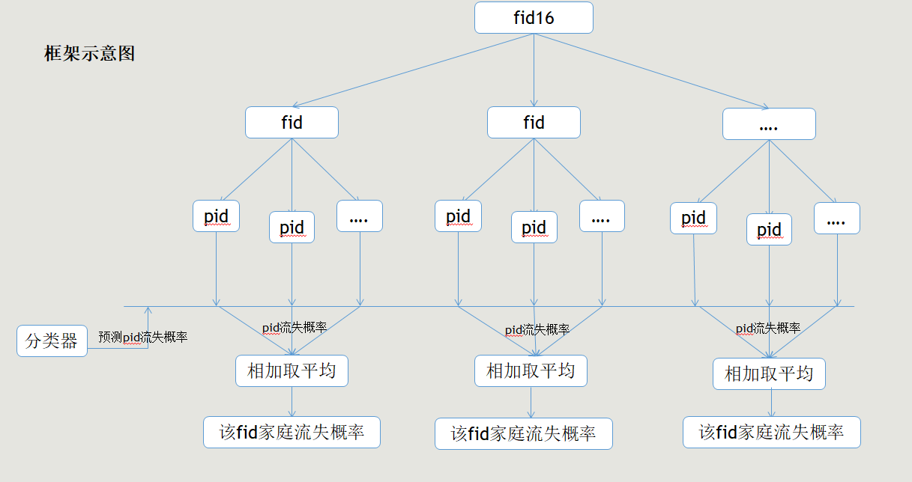
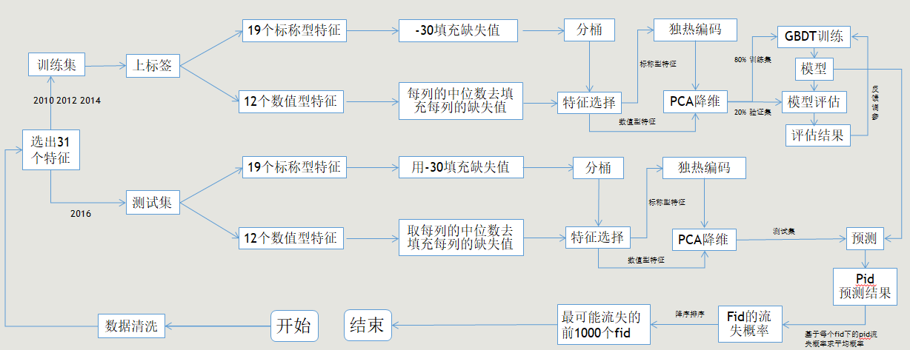
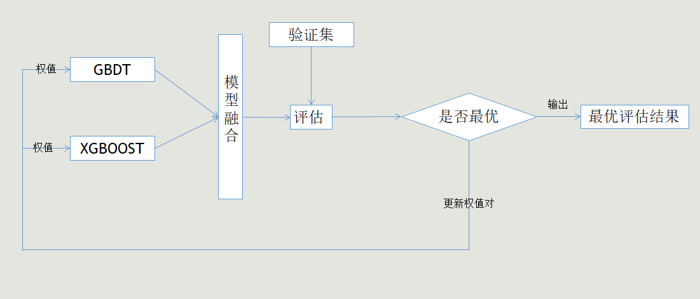

##程序呢运行说明
        0.运行环境：Anaconda python 3.7.2 还要额外导入xgboost包
        1.read_json.py  # 读取队员在数据中找到的重要特征并生成的json文件,并将生成各个年份的csv文件
        2.data_consistence.py  # 读取第一步的py程序生成的各个年份形成csv文件，并将文件生成train_set.csv 和　test_set.csv
        3.data_train_and_predict.py  # 读取第第二步的py程序生成的训练集和测试集，并对其进行特征工程和建模以及预测操作，生成最终需要final_disappear_fid.csv文件，从而得到最终消失的1000个fid
###文件夹与文件
        1.data_consistent_output_file  # data_consistence.py中途生成的文件存放地址
        2.data_to_train_and_test  # 存放data_consistence.py生成的训练集和测试集的csv文件
        3.image  # 存放图片
        4.JSON  # 存放read_json.py程序需要读取的json文件
        5.model  # 存放data_train_and_predict.py程序生成的模型
        6.read_json_output_file  # 存放read_json.py程序中途生成文件
        7.temp  # 存放暂时用不到的代码
        8.show_table.csv, feature.txt, summit.csv  # 程序中途生成的临时性文件
        9.final_disappear_fid_multiply_model.csv  # 模型融合的最终的结果文件
        10.final_disappear_fid_single_model_gbdt.csv  # GBDT模型的最终的结果文件
        11.final_disappear_fid_single_model_xgb.csv  # XGBoost模型的最终的结果文件
## 队伍简介

深圳大学信息中心研究生大数据与网络空间安全研一团队

## 赛题回顾
[本赛题地址](http://opendata.pku.edu.cn/competition-2019.xhtml?from=groupmessage&isappinstalled=0)
 基于“中国家庭追踪调查”（CFPS）的数据发现和挖掘。
 分主题１：预测家庭样本的流失。参赛者在CFPS 2016年发布的家庭关系库中近15000个fid16中选出1000个最有可能在2018年流失的家庭。CFPS 2018实地工作结束后我们根据执行的最后结果选出命中率最高的参赛作品。
 数据：[下载链接](http://opendata.pku.edu.cn/dataset.xhtml?persistentId=doi:10.18170/DVN/45LCSO)

## 解决方案概述
问题：15000个fid16中选出1000个最有可能在2018年流失的家庭。(CFPS 2018实地工作结束后我们根据执行的最后结果选出命中率最高的参赛作品)

`流失家庭的定义`:家庭流失即fid在下一个调查年份不在出现，当某个fid中的家庭人员因为死亡，分家，婚姻而组建新的家庭，导致原有家庭人员不复存在的时候，即为家庭流失。

基于流失家庭的定义，我们利用机器学习算法训练一个模型，用来预测家庭中的成员的流失概率，再对每个家庭里的所有成员的流失概率进行相加再平均，最终得到该家庭(fid)的流失概率

## 框架示意图

## 特征工程与训练和预测过程
###单模训练

	
###多模训练
XGBoost与GBDT简单的加权平均

